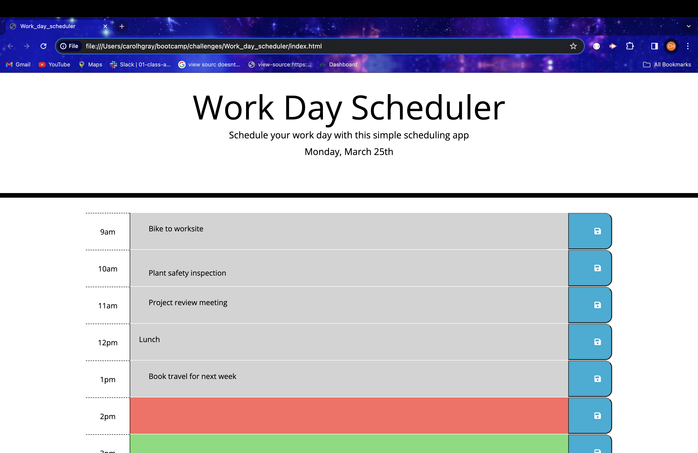

# Work_day_scheduler

## Description

This work day scheduler employs CSS, HTML, Javascript, and APIs to create a functioning schedule for the user.  

## Installation
Open the app at the following web location:

https://CarolHGray.github.io/Work_day_scheduler/

## Usage
Today's date and time blocks for each hour of the work day will appear on the screen. Space for the user to enter tasks are in each block.  Gray spaces show past time blocks, red spaces indicate present and green spaces indicate future.  After typing in the task in each time block, the user can go to the "save" button on the right of the time block. This lets the task entry persist on the work schedule even after the page is refreshed.

Screenshot of website:

## License
MIT License